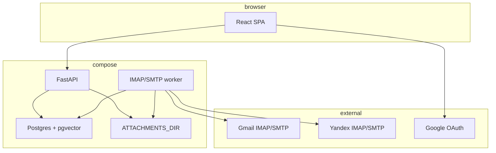

# Design: mail-stream-v1

## Architecture overview



```text
Diagram: v1 runtime (flowchart)
  [React SPA] --> [FastAPI]
  [FastAPI] --> [Postgres+pgvector]
  [FastAPI] --> [ATTACHMENTS_DIR]
  [React SPA] --> [Google OAuth]
  [IMAP/SMTP worker] --> [Postgres+pgvector]
  [IMAP/SMTP worker] --> [ATTACHMENTS_DIR]
  [IMAP/SMTP worker] --> [Gmail]
  [IMAP/SMTP worker] --> [Yandex]
```

Browser talks **only** to FastAPI (same origin). Worker never serves HTTP. No 1C process in v1.

## Decision log

### D1. Placement

Code and OpenSpec live in `z/mymind/` / `askred-dot-ru/mymind`. MyMind is a separate product, not a 1C configuration or CFE.

### D2. Standalone IMAP in Python

Mail protocol runs in the Python worker (`imapclient` IDLE + SMTP). This is not a 1C application; platform `ИнтернетПочта` is out of scope.

### D3. Compose now, host later

Three services: `api`, `worker`, `db` (image `pgvector/pgvector:pg16`). No Docker hostnames in application code — only `DATABASE_URL`, `ATTACHMENTS_DIR`, `HTTP_HOST`, `HTTP_PORT`, `PUBLIC_BASE_URL`. Native install = same binaries + host Postgres with `CREATE EXTENSION vector`.

### D4. Envelope + per-kind tables

`knowledge_items` is the common row (id, `stream_kind`, `owner_user_id`, timestamps, `embedding vector(1536)` NULL). Mail payload in `mail_*`. Inserting `messenger` / `llm_session` is forbidden in v1 application code (check constraint still allows the enum so later migrations do not rewrite the column).

### D5. Classification two-layer, UI one-layer in v1

Tables `topics`, `item_topics` exist. v1 UI uses only native mail folders/labels. MyMind topics have no screens. Rationale: product is a classifier, but mail already has folders; overlay UI waits for a second stream.

### D6. Distribution stub (internal)

Table `distribution_routes` (`item_id`, `channel`, `payload_json`, `status=stub`). No dispatcher in v1. No 1C channel, no `user_1c_*` tables, no `/onec` routes, no `ONEC_*` env.

Later (separate change): outbound HTTP from MyMind to an external system (hypothetically 1C). Base URL and actions are unknown; do not invent them now.

### D7. Identity

- Table `users`: login (citext unique), `password_hash` argon2id, `role` ∈ {`user`,`admin`}, `is_active`.
- Bootstrap: if no admin exists, `MYMIND_BOOTSTRAP_ADMIN` + `MYMIND_BOOTSTRAP_PASSWORD` creates one at API start (logged once, not echoed).
- After that, **self-registration** `POST /api/v1/auth/register` creates `role=user`.
- Session: signed httponly cookie `mymind_session`, `SameSite=Lax`, secret `SESSION_SECRET`.
- ACL: `user` — rows where `owner_user_id = current`. `admin` — all rows. Impersonation is read-only query `?as_user_id=` only for admin.

### D8. Secrets

- Yandex app password and Gmail refresh token stored in `mail_account_secrets.blob` encrypted with Fernet key `APP_MASTER_KEY` (urlsafe 32-byte, env only).
- `GOOGLE_OAUTH_CLIENT_ID` / `GOOGLE_OAUTH_CLIENT_SECRET` only in env. If missing, API returns 409 `gmail_oauth_not_configured` on Gmail connect; Yandex path stays up.
- Never commit `.env`. Provide `.env.example` with empty values.

### D9. Mailbox model

- `mail_accounts`: owner, provider ∈ {`gmail`,`yandex`}, email, `imap_host`, `imap_port`, `smtp_host`, `smtp_port`, `use_ssl`, `unified=true` (default), `is_default_compose`, `sync_state`.
- Defaults: Gmail `imap.gmail.com:993` / `smtp.gmail.com:465`; Yandex `imap.yandex.ru:993` / `smtp.yandex.ru:465`.
- Unified: canonical folders merge by case-insensitive name across `unified=true` accounts of one user. An account with `unified=false` has its own tree prefixed by email.
- Each `mail_messages` row has `account_id` (UID unique per account+folder). Delete/send use that account.
- Reply/forward: From = message's account. New compose: From = `is_default_compose` account, dropdown to switch.

### D10. Folders and actions

Canonical names (stable ids): `inbox`, `sent`, `drafts`, `trash`, `archive`, `spam`, plus `user:<normalized>`.

IMAP map (worker, overridable later in DB):

| Canonical | Gmail | Yandex |
|---|---|---|
| inbox | INBOX | INBOX |
| sent | [Gmail]/Sent Mail | Sent / Отправленные |
| drafts | [Gmail]/Drafts | Drafts / Черновики |
| trash | [Gmail]/Trash | Trash / Удалённые |
| archive | remove INBOX label (X-GM-LABELS) | folder Archive / Архив (create if missing) |
| spam | [Gmail]/Spam | Spam / Спам |

Delete in UI: copy/move to trash folder + `\Deleted` on the source; list hides it. Empty trash: EXPUNGE on trash. Archive: Gmail strip INBOX; Yandex MOVE to Archive.

### D11. Threads

`mail_threads.id`. Link by RFC `Message-ID` / `In-Reply-To` / `References`. Fallback: normalized subject (strip Re:/Fwd:) + participants if no headers. UI: left list is thread heads (latest message time); right pane is chronological bodies of that thread. Clicking any member still opens the same thread.

### D12. Copy and search

- Full MIME parsed; `body_text`, `body_html` in Postgres; attachments as files `ATTACHMENTS_DIR/{account_id}/{message_uid}/{safe_filename}` + row with sha256, size, mime.
- FTS: generated `tsvector` on subject+body_text, config `simple` (no Russian dict dependency in the image). Query `plainto_tsquery`.
- Vector: column exists, **no job, no API search by embedding**.

### D13. Worker

One worker process per deployment, all accounts. Per account: IMAP SELECT INBOX + IDLE; on EXISTS/FETCH sync that folder then others on a 60s timer. Backoff 5s → 60s on error. Sends: API inserts `mail_outbox` (`pending`); worker SMTP then IMAP APPEND to Sent; mark `sent` or `failed` with error text.

### D14. HTTP surface (normative)

Prefix `/api/v1`. JSON. 401 without session except register/login/oauth callback.

| Method | Path | Role |
|---|---|---|
| POST | /auth/register | anon |
| POST | /auth/login | anon |
| POST | /auth/logout | any |
| GET | /me | any |
| GET/POST | /mail/accounts | owner |
| POST | /mail/accounts/gmail/start | owner (or 409) |
| GET | /mail/accounts/gmail/callback | oauth |
| PATCH | /mail/accounts/{id} | owner (`unified`, `is_default_compose`) |
| GET | /mail/folders | owner/admin |
| GET | /mail/threads | query: folder, q, as_user_id |
| GET | /mail/threads/{id} | messages + attachments meta |
| POST | /mail/threads/{id}/read | flags |
| POST | /mail/messages/{id}/trash | |
| POST | /mail/messages/{id}/archive | |
| POST | /mail/folders/trash/empty | EXPUNGE |
| POST | /mail/messages | compose/reply/forward (`in_reply_to` optional) |
| GET | /mail/attachments/{id} | file |
| GET | /health | anon |

React is served by API from `web/dist` on `/`. Vite dev proxy is optional for local; Compose builds the SPA into the API image.

### D15. Stack versions (pinned)

Python 3.12, FastAPI, SQLAlchemy 2 + Alembic, `imapclient`, `google-auth-oauthlib`, `cryptography`, `argon2-cffi`, React 18 + Vite + TypeScript. No extra UI kit required: functional layout (list | thread).

### D16. Logging and PII

JSON logs to stdout. Do not log passwords, tokens, raw message bodies. Message ids and account ids only. Future embedding providers must go through a sanitizer; v1 does not call them.

### D17. Messengers / LLM

No collectors, no bot tokens, no ChatOps. Enum values exist only so the next change does not rename `stream_kind`.

## Risks

- Gmail OAuth redirect must equal `PUBLIC_BASE_URL + /api/v1/mail/accounts/gmail/callback`.
- Provider folder names vary by locale; worker maps with a fallback LIST + substring match (`Sent`, `Отправленные`) and stores the chosen IMAP name on `mail_folder_maps`.
- Large HTML: store as-is; UI sanitizes with DOMPurify in React before `dangerouslySetInnerHTML`.

## Open Questions

None. Env `GOOGLE_OAUTH_*` empty is a documented disable path (D8), not an apply-time question.

## Context sources

Verified via MCP: `recall` 585–588, 590 (standalone product; no 1C in v1; later HTTP unknown). `templatesearch`: no matching template for FastAPI/IMAP. Graph/code MCP skipped (not 1C sources). Platform `ИнтернетПочта` not used (D2).
