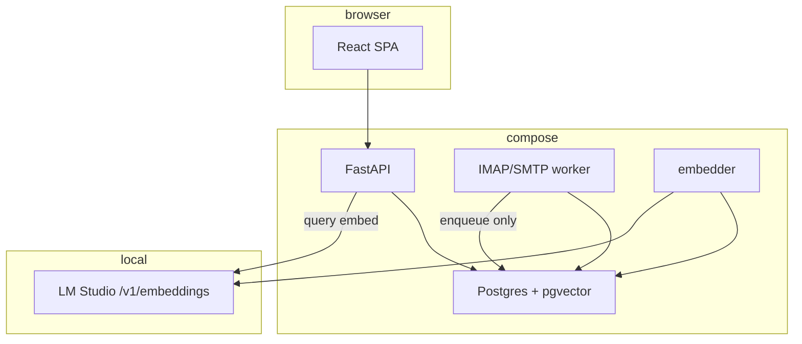

# Design: semantic-index-v1

## Architecture overview



```text
Diagram: semantic-index-v1 runtime
  [React] --> [FastAPI] --> [Postgres+pgvector]
  [IMAP worker] --> [Postgres]  (enqueue; no embed HTTP)
  [embedder] --> [Postgres]
  [embedder] --> [LM Studio /v1/embeddings]
  [FastAPI] --> [LM Studio]  (query vector only)
```

IMAP worker never embeds. API embeds **queries** only (LRU). Embedder embeds **passages**.

## Decision log

### D1. New OpenSpec change, not a patch of mail-stream-v1

`mail-stream-v1` is archived (`openspec/changes/archive/2026-09-18-mail-stream-v1`). Baseline: `embedding IS NULL`, no embed job. This change **MODIFIES** those requirements.

### D2. pgvector, not zvec

Keep Postgres. Do not add SQLite/zvec/Qdrant. Do not copy cfsmcp2 sources (AGPL-3.0). Reuse ideas: hybrid RRF, chunk char budgets, parse-then-index, resume, query LRU, model-scoped vectors.

### D3. Retrieval grain = chunks

Table `knowledge_chunks`: `item_id`, `ordinal`, `body` (passage text), `content_hash`, `embedding`, `model_id`. Unique `(item_id, ordinal)`.

`knowledge_items.embedding` stays nullable and **unused** for search (future summary). Do not write chunk vectors there.

HNSW: `vector_cosine_ops` on `knowledge_chunks.embedding`. Filter `model_id = current` **and** `knowledge_items.owner_user_id` in the same SQL (no global ANN then post-filter).

### D4. Eligible folders

Index: `inbox`, `sent`, `drafts`, `archive`, `user:*`.  
Do not index: `spam`, `trash`.

On move into spam/trash: delete that item's chunks and pending queue rows. On move back to an eligible folder: enqueue.

Skip enqueue when passage text is empty (no subject and no `body_text`).

Do not embed HTML or attachments.

### D5. Queue, not IDLE

Table `embed_queue` (`item_id`, `reason`, `status ∈ {pending, done, failed}`, `error_text`, `attempts`, timestamps). `store_mail` / `park_message` insert or cancel. Embedder claims `pending`, batches, upserts chunks, marks `done`/`failed`.

Resume after crash: leftover `pending` / in-flight reset to `pending` on embedder start.

`content_hash` of the passage source (subject+from+body_text) skips re-embed when unchanged **and** `model_id` matches.

### D6. Local OpenAI-compatible embeddings

Env `LM_STUDIO_URL` (no Docker hostname in application code). Compose injects `http://host.docker.internal:1234`. Native default `http://127.0.0.1:1234`.

Default `model_id`: `text-embedding-multilingual-e5-small` (cfsmcp2 default). Probe dim with one embed of `"ping"`; persist `embedding_dim` (384 for this model).

For this default id, **no** `query:` / `passage:` prefixes (match cfsmcp2 `PREFIX_MODELS`, which only tags `*-instruct`). If a later model id contains `e5-large-instruct` / `multilingual-e5-large-instruct`, apply those prefixes.

Batch 128, max 256 texts per HTTP request, retries on 408/429/5xx. Query-vector LRU 256.

`EMBEDDING_WORKERS` default 2 (1/2/4/8/12/16 allowed, same caps as cfsmcp2).

### D7. One active model per installation

`app_settings` keys: `embedding_model`, `embedding_dim`, `embed_generation` (int). Not per-user.

Admin PUT new `model_id`:

1. Confirm in UI (`window.confirm`: переиндексировать всю базу).
2. Probe endpoint + dim. If probe fails → 502, no generation bump.
3. If dim ≠ stored dim: `ALTER` column + drop/create HNSW, then store new dim.
4. `embed_generation += 1`; enqueue all eligible items; vector search uses only chunks with the new `model_id`.

Old chunks may remain until overwritten/deleted; cosine **MUST** ignore them.

### D8. Hybrid search

`GET /api/v1/search`

| Query | Meaning |
|---|---|
| `q` | required, trimmed; empty → 400 |
| `mode` | `hybrid` (default) \| `fts` \| `vector` |
| `folder` | optional canonical; still never spam/trash |
| `as_user_id` | admin, read-only |
| `limit` | default 50, max 100 |

RRF with `k=60`, equal FTS and vector lists. FTS stays `plainto_tsquery('simple', q)` on `mail_messages.fts`. Vector: embed `q`, cosine on current `model_id` chunks joined to eligible messages.

Hits: `item_id`, `message_id`, `thread_id`, `folder_canonical`, `subject`, `from_addr`, `snippet`, `score`, `stream_kind`. Snippet from chunk or body, not raw HTML.

Owner filter always. Admin inspect via `as_user_id` like mail threads. Compose-as-other remains 403 (search is read-only).

GET `/mail/threads?q=` **unchanged** (folder FTS). Inbox important/unimportant bucket inputs stay **client filters** of that section.

### D9. Mail UI

Existing non-inbox omnibar (placeholder already «Поиск знаний, писем, тегов»): on submit, call `/api/v1/search` hybrid and render **search hits** (snippet + folder + thread), not folder-FTS heads. Click opens the thread in the right pane (load `GET /mail/threads/{id}`).

Inbox: add the same omnibar in list chrome **above** the two buckets. Bucket «Поиск» remains local.

Ctrl/Cmd+K focuses the hybrid omnibar.

If `q` is empty, list behaviour is unchanged (folder heads).

Muted line under omnibar when the user's eligible `indexed < eligible`: «Индекс считается (N / M)».

### D10. Settings card and header badge

Page `/settings`: extra `.card` titled **Индекс знаний**. Same CSS as «Не важные домены» (`h2`, `p.muted`, `select`/`input`, `button.primary`). No new UI kit, no charts.

Read-only for every signed-in user: endpoint ping, current model, dim, generation, state (`ready` \| `indexing` \| `endpoint_down` \| `error`), bar (`indexed / eligible` for **this** user), `failed` count, last error (message id + short text, never body).

Admin only: `<select>` of embedding models from `GET {LM_STUDIO_URL}/v1/models` (ids that look like embed/e5/bge/nomic/gte/jina, plus currently saved id). «другая…» → text field. Button **Применить и переиндексировать** disabled when id equals current or endpoint down. `window.confirm` then PUT. **Повторить ошибки** when `failed > 0`.

`LM_STUDIO_URL` is env-only in this change (shown, not edited).

Header (`AppHeader` on the mail shell): badge `Индекс N%` while that user's `indexed < eligible` or state is `indexing`/`endpoint_down`. Poll status every 2s while not `ready`.

Nav link label: **Настройки** (was «Ящики»).

### D11. HTTP surface (additive)

Prefix `/api/v1`. Session required except `/health`.

| Method | Path | Role |
|---|---|---|
| GET | /search | owner / admin `as_user_id` |
| GET | /index/status | any signed-in (counts scoped to owner unless admin inspect) |
| GET | /index/models | admin |
| PUT | /index/model | admin body `{ "model_id": "..." }` |
| POST | /index/retry-failed | admin (requeue `failed` for all, or owner if we later add user retry — **admin, all failed** in this change) |

`GET /health` remains Postgres-only (200/503). Index/LM failure must not 503 the process.

### D12. Compose

Services: `db`, `api`, `worker`, **`embedder`**. Embedder: same image, command `python -m embedder.main`. Env: `DATABASE_URL`, `LM_STUDIO_URL`, `EMBEDDING_BATCH_SIZE`, `EMBEDDING_WORKERS`. `extra_hosts: host.docker.internal:host-gateway`. No public HTTP port on embedder.

### D13. Chunk text and size

Passage = `subject | from_addr | sent_at (ISO) | body_text` window.

Char budgets (cfsmcp2 e5 512-token preset, no tokenizer, RU ~2.7–2.9 chars/token):

| key | value |
|---|---|
| passage_max_chars | 1350 |
| chunk_size | 1100 |
| chunk_overlap | 130 |
| min_body_chars | 200 |
| max_chunks | 12 |

Ordinal 0 = first window; extra windows `1..n-1`. On shorter re-split, delete leftover ordinals.

### D14. Logging and PII

JSON stdout. No passwords, tokens, raw bodies, From personal names beyond what existing mail logs already allow (ids only). Embed HTTP payloads are local; still do not log passage text. Future chat (not this change) must sanitise before any **external** LLM.

### D15. Chat / DeepSeek

Out of this change. No `LLM_BASE_URL` / DeepSeek keys. `stream_kind=llm_session` still not writable.

## Risks

- Dim ALTER on a large `knowledge_chunks` table can lock; run in the PUT path before enqueue, fail the PUT if migration fails.
- Shared LM Studio with cfsmcp2: heavy 1C reindex can stall Oh!MyMind embedder — queue retries, mail stays up.
- Inbox has two local searches plus a new omnibar — do not wire bucket inputs to hybrid (would break domain tabs).

## Open Questions

None. Model default, local endpoint, no spam/trash, settings card, hybrid omnibar, chat deferred — locked with the user 2026-09-18.

## Context sources

Specs as archived 2026-09-18. Code: `web/src/pages/Mail.tsx` omnibar / inbox buckets; `web/src/pages/Settings.tsx` `.card`; `app/providers.py` canonical folders. cfsmcp2 `app/services/bsl_embed.py` limits, `embeddings.py` LRU/retry, ARCHITECTURE §4.3 / §10 (chat deferred, RRF). User decisions this thread. 1C MCP skipped.
